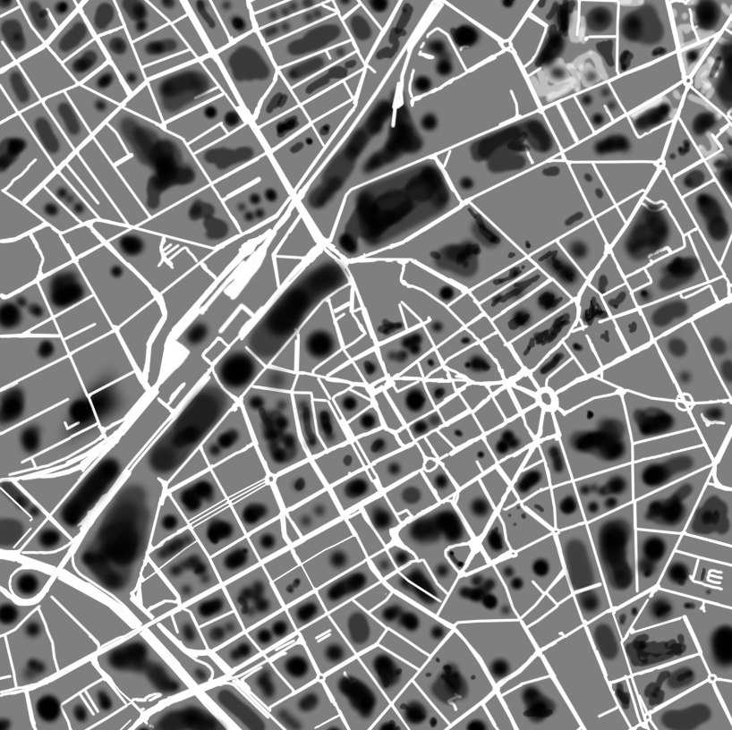
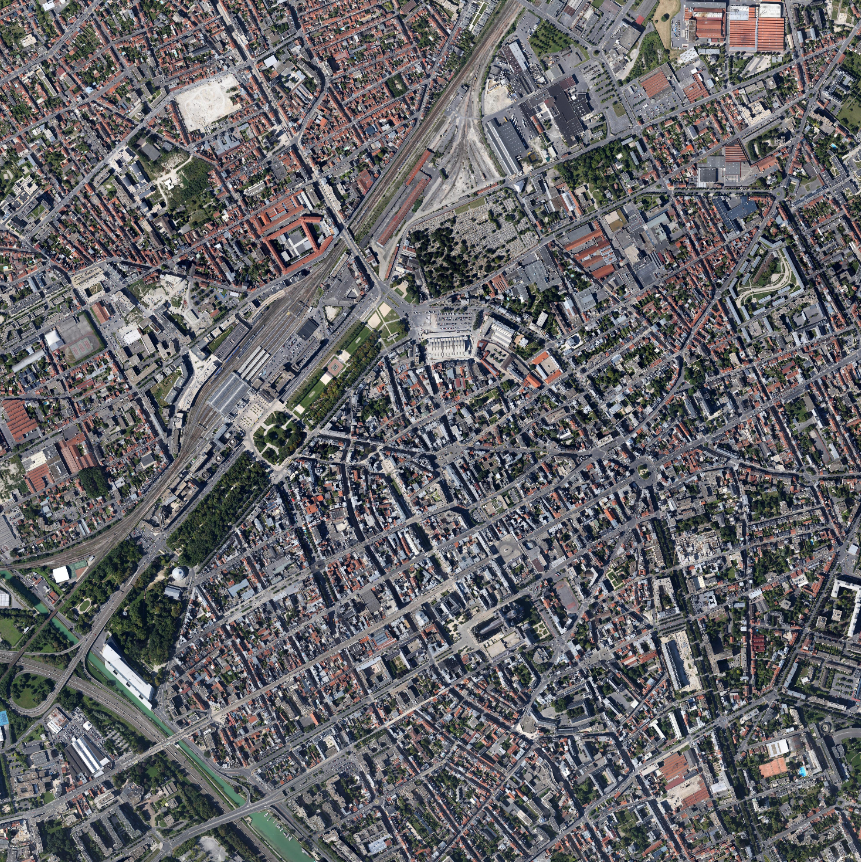
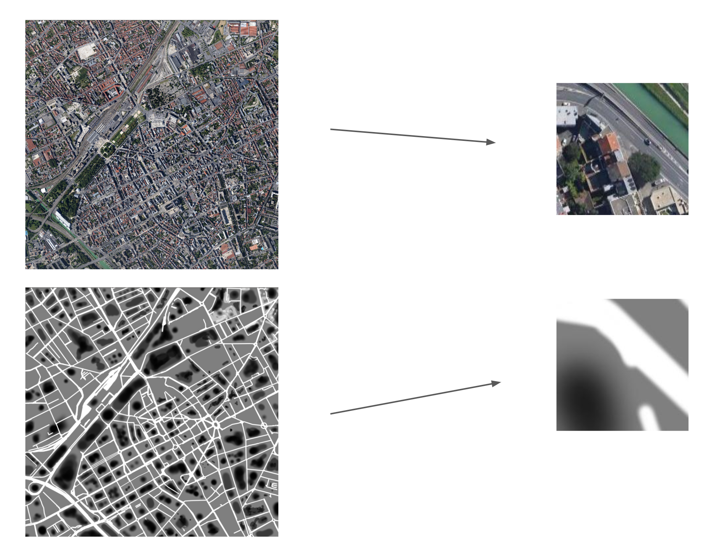
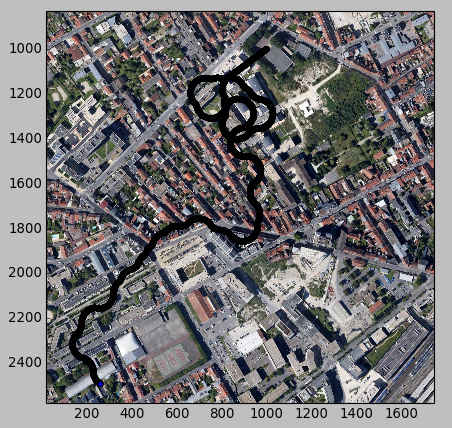

# Drone AI

## Objective

Give a drone the ability to assess to safety of a landing zone underneath from a video feed and to look for a landing zone safe enough. To be able to test the results I'll implement a basic simulation.

## Train the ConvNet (Inception) 

To train the network, I picked a satelite image of a city and drawn a mask of "danger" where the brightness of a pixel represent the level of risk.

http://www.mediafire.com/view/5hdm63pad6cw29s/Out.bmp

http://www.mediafire.com/view/mlk5tweibs6ggz0/Base.bmp

Then we use *Data_compilation.py* to split the two images in many pairs of small crops that correspond it the same geographical region. 

We can use the data generated to train a segmentation network but for our use a classifier semms more apropriate.
To train a classifier, we can seperate the images by calculating the level of "safety" with the average of the pixel brightness.

This work is done by *class.py*

## Simulation

After the training and the testing of the network, we can test our results with a simulation.

*camera.py* simulate the live video feed by croping or rotating an image at the simulated position of the drone

*simulation.py* use the train model to evaluate the safety of a zone and simulate the movements of the drone. We decide witch way to go by assessing the level of safety of both the right corner and left corner of the image.

